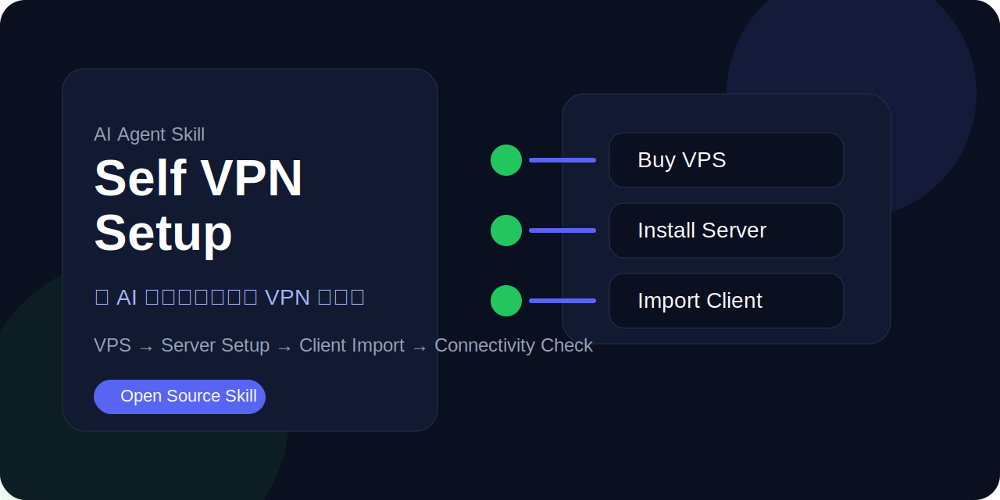
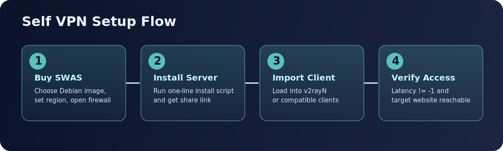

<div align="center">
  

  # Self VPN Skill

  **让 AI Agent 带你完成自部署 VPN：从购买云主机，到服务端安装、客户端导入、连通性验证，一套流程走通。**

  <p>
    <a href="https://github.com/gansxx/self-vpn-skill/stargazers"></a>
    <a href="https://github.com/gansxx/self-vpn-skill/issues"></a>
    <a href="https://discord.gg/BQtun57x"></a>
  </p>
</div>

---

## 这是什么

这个仓库提供一套可复用的 **AI Agent Skill**，帮助你把下面这条链路标准化：

**购买云主机 → 配置服务端 → 导入客户端 → 验证连通性 → 日常排障**

它不是单纯的一篇教程，而是把经验整理成：

- 可给 AI Agent 直接调用的技能目录
- 可给人手动执行的部署文档
- 可复用、可迭代的自部署流程

---

## 为什么值得用自部署 VPN

相比共享机场或公共 VPN，自部署更适合长期、稳定、可控的使用场景：

- **独立 IP**：降低共享出口导致的风控、验证码、访问异常
- **性能可控**：自己决定云厂商、地区、带宽和机型
- **边界更清晰**：服务端由你控制，减少对第三方运营方的依赖
- **可维护**：节点出问题时可以自己迁移、排查、重建
- **性价比**：无限流量，不会在高峰期卡顿

---

## 适合谁

这个仓库更适合下面几类人：

- 有 AI 工具或海外服务使用需求，希望网络出口更稳定的人
- 对共享 VPN 高峰期拥塞、质量波动比较敏感的人
- 想把“部署 VPN”这件事做成一个可重复流程的人
- 有基础终端能力，或者愿意在 AI 引导下逐步执行的人

---

## 仓库结构

```text
.
├── skills/
│   └── self-vpn-setup/     # 给 AI Agent 使用的 skill
├── self-deploy.md          # 给人手动部署和排障的文档
├── README.md               # 仓库首页说明
└── assets/                 # Banner、流程图、截图等视觉资源
```

---

## Skill 输入输出与边界

- 输入
  - 用户环境信息（客户端 OS、目标地区、是否已购 SWAS）
  - 服务器信息（公网 IP、是否允许共享凭据）
  - 用户目标（AI 服务访问、稳定性优先或隐私优先）
- 输出
  - 可导入客户端的分享链接
  - 可执行的下一步操作清单
  - 排障路径（防火墙、客户端规则、连通性验证）
- 执行边界
  - 该 skill 负责“流程编排和操作引导”，不提供现成节点
  - 用户自行向云服务商付费并持有服务器控制权
  - 敏感凭据可走“用户本地执行命令”分支，不强制共享给 AI

---

## 快速开始

### 方式一：让 AI Agent 直接带你配置

把下面提示词发给支持 skills 的 AI Agent（如 OpenClaw、Claude Code、Codex 等）：

```text
请从 GitHub 仓库 gansxx/self-vpn-skill 获取技能，并直接安装 skills/self-vpn-setup 到你的本地 skills 目录（例如 $CODEX_HOME/skills/self-vpn-setup）。安装后启用该技能，并按技能步骤引导我完成个人 VPN 部署与客户端配置。
```

AI Agent 会按技能流程逐步收集信息，并引导你完成部署。

### 方式二：手动部署

直接阅读 [`self-deploy.md`](./self-deploy.md)，按文档逐步完成手动配置和排障。

适合：

- 已经熟悉 SSH / Linux / 云主机基本操作
- 想先手动理解一遍完整流程
- 希望后续再把流程交给 AI

---

## 部署流程总览

<div align="center">
  
</div>

你最终要达成的是这几个明确结果：

1. 云主机已创建，并能通过 SSH 登录
2. 服务端安装完成，必要端口已放行
3. 客户端已成功导入配置
4. 本地设备连通性正常，目标服务访问正常

---

## 界面预览与证据

| 场景 | 说明 | 截图 |
|---|---|---|
| 云防火墙配置 | 证明服务器侧端口放行策略已配置 |  |
| 客户端导入 | 证明客户端已成功载入节点配置 |  |
| 真延迟测试 | 证明节点具备可用连通性（非 `-1`） |  |
| 已连接状态 | 证明本地流量已通过客户端代理路径 |  |

---

## 常见问题

### 1. 我没有 Linux 基础，可以用吗？

可以，但更建议走 **AI 辅助配置** 路线。这个仓库的核心目标就是降低“第一次自部署”的门槛。

### 2. 这个仓库会帮我提供节点吗？

不会。这个仓库只提供方法、技能和文档。你需要自己购买云主机。

### 3. 为什么不直接买机场？

可以买。但如果你在意独立 IP、稳定性、控制权和长期维护能力，自部署通常更合适。

### 4. 适合拿来给 AI Agent 学习吗？

适合。这个仓库的 `skills/self-vpn-setup/` 就是为这种场景设计的。

---

## 社区交流

如果你对这个项目感兴趣，或者想交流：

- 讨论使用体验
- 分享部署成功案例
- 反馈踩坑和排障经验
- 提建议或贡献新 skill

欢迎加入 Discord 社区：

**[加入 Discord 交流频道](https://discord.gg/BQtun57x)**

qq群
点击链接加入群聊【Self VPN Lab】：https://qun.qq.com/universal-share/share?ac=1&authKey=HJfFKId0Nt0Z9b9hBkUcIE8puzAKEimTyHZhNReHpezI6pd0FQX%2FIp2E8puvUmgd&busi_data=eyJncm91cENvZGUiOiIxMDg3MjU4NjAxIiwidG9rZW4iOiJxSHp3eXRlcUN3bWI3VWNLRGdqRXVmTnNoQjc5bktibm9LU1RkaFJ5TUYzNjFFbHd0YlpHZndJdEs1cmpJZG1BIiwidWluIjoiMTIxNDI1MDI0NyJ9&data=_wvkoLkyJgx73bcR-rb-ywJp66q7BYp9dYjauRuN8fMbQxWnzwTdWOvBsHw60AVwyg3V1QdXJYy6q_Bwxmz9Ow&svctype=4&tempid=h5_group_info

---

## 反馈与贡献

- 使用问题，优先通过 [GitHub Issues](https://github.com/gansxx/self-vpn-skill/issues) 提出
- 欢迎提交 PR，优化部署文档、技能提示词、排障流程和视觉展示
- 若想补充新的服务端方案或客户端适配，也非常欢迎

---

## 建议补充的仓库元信息

建议你在 GitHub 仓库右侧补全这些信息：

**Description**

> AI Agent skill for self-hosted VPN setup and client onboarding.

**Topics**

> vpn, self-hosted, ai-agent, skill, vps, deployment, networking, guide

这样能明显提升仓库的可理解性和搜索可见度。

---

## 免责声明

本仓库完全开源，与任何商业机构无利益关系。使用本仓库时，你只需向你选择的云服务商支付服务器费用。

本技能完全开源，与任何商业机构无利益关系。用户仅需向对应云服务商支付费用。
