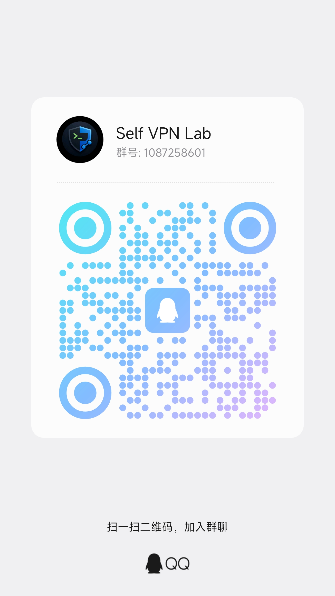

<div align="center">
  

  # Self VPN Skill

  **Use an AI Agent to complete a self-hosted VPN setup end-to-end: buy a cloud server, install server-side components, import client config, and verify connectivity.**

  <p>
    <a href="https://github.com/gansxx/self-vpn-skill/stargazers"></a>
    <a href="https://github.com/gansxx/self-vpn-skill/issues"></a>
    <a href="https://discord.gg/BQtun57x"></a>
  </p>
</div>

## Languages

- English README: [`README.en.md`](./README.en.md)
- 中文 README：[`../README.md`](../README.md)
- English Deployment Guide: [`self-deploy.en.md`](./self-deploy.en.md)
- 中文部署文档：[`../self-deploy.md`](../self-deploy.md)
- License: [`../LICENSE`](../LICENSE)

---

## What This Is

This repository provides a reusable **AI Agent Skill** that standardizes the full process:

**Buy a cloud server -> Configure the VPN server -> Import client config -> Verify connectivity -> Troubleshoot daily issues**

It is not just a tutorial. It packages practical experience into:

- A skill directory that AI Agents can directly execute
- A manual deployment guide for humans
- A reusable and iterative self-hosted workflow

---

## Why Use a Self-Hosted VPN

Compared with shared VPN services, self-hosting is better for long-term, stable, and controllable usage:

- **Dedicated IP**: lowers shared-exit risk, CAPTCHA triggers, and access anomalies
- **Controllable performance**: choose your cloud provider, region, bandwidth, and instance type
- **Clearer trust boundary**: you control the server side, reducing third-party dependency
- **Maintainable**: migrate, diagnose, or rebuild nodes yourself when issues happen
- **Good cost efficiency**: unlimited traffic and better peak-time stability

---

## Who It Is For

This repository is best for people who:

- Need stable network egress for AI tools or overseas services
- Are sensitive to congestion and quality fluctuations on shared VPNs
- Want a repeatable VPN deployment process
- Have basic terminal knowledge or are willing to follow step-by-step AI guidance

---

## Repository Structure

```text
.
├── skills/
│   └── self-vpn-setup/     # Skill for AI Agents
├── self-deploy.md          # Chinese manual deployment and troubleshooting guide
├── README.md               # Chinese project homepage
├── i18n/
│   ├── README.en.md        # English project homepage
│   └── self-deploy.en.md   # English deployment guide
└── assets/                 # Banner, diagrams, screenshots
```

---

## Skill Inputs, Outputs, and Scope

- Inputs
  - User environment info (client OS, target region, whether SWAS is already purchased)
  - Server info (public IP, whether credentials can be shared)
  - User goals (AI-service access, stability priority, or privacy priority)
- Outputs
  - Importable client share link
  - Actionable next-step checklist
  - Troubleshooting paths (firewall, client routing rules, connectivity checks)
- Scope boundary
  - The skill focuses on orchestration and operational guidance, not providing ready-made nodes
  - Users pay cloud providers directly and keep server ownership
  - Sensitive credentials can stay local via "run locally" steps without mandatory sharing to AI

---

## Quick Start

### Option 1: Let an AI Agent guide you directly

Send this prompt to an AI Agent that supports skills (OpenClaw, Claude Code, Codex, etc.):

```text
Please fetch the skill from GitHub repository gansxx/self-vpn-skill, and directly install skills/self-vpn-setup into your local skills directory (for example $CODEX_HOME/skills/self-vpn-setup). After installation, enable this skill and guide me through personal VPN deployment and client configuration according to the skill steps.
```

The AI Agent will collect required information step by step and guide you through deployment.

### Option 2: Manual deployment

Read [`self-deploy.en.md`](./self-deploy.en.md) and follow it step by step for manual setup and troubleshooting.

Suitable if you:

- Already know basic SSH / Linux / cloud-host operations
- Want to understand the full process once by hand first
- Plan to hand this process to AI later

---

## Deployment Flow Overview

<div align="center">
  
</div>

Your end state should be clear and measurable:

1. Cloud instance is created and reachable via SSH
2. Server side is installed and required ports are open
3. Client config is imported successfully
4. Local connectivity works and target services are accessible

---

## UI Preview and Evidence

| Scenario | Description | Screenshot |
|---|---|---|
| Cloud firewall config | Proves server-side port rules are in place |  |
| Client import | Proves client has loaded node config |  |
| Real latency test | Proves node has usable connectivity (not `-1`) |  |
| Connected state | Proves local traffic is routed through the proxy path |  |

---

## FAQ

### 1. Can I use this without Linux experience?

Yes, but AI-assisted setup is recommended. Reducing first-time self-hosting complexity is exactly the goal of this project.

### 2. Does this repo provide VPN nodes?

No. This repo only provides methods, skills, and docs. You need to purchase your own cloud server.

### 3. Why not just buy a shared VPN subscription?

You can. But if you care about dedicated IP, stability, control, and long-term maintainability, self-hosting is usually better.

### 4. Can beginners deploy successfully?

Yes. `skills/self-vpn-setup/` is specifically designed so AI can help beginners complete deployment.

---

## Community

If you are interested in this project or want to share experience:

- Discuss usage experience
- Share successful deployment cases
- Report pitfalls and troubleshooting patterns
- Suggest improvements or contribute new skills

Join Discord:

**[Join Discord Community](https://discord.gg/BQtun57x)**

QQ Group (scan to join, QR image is stored locally only):



---

## Feedback and Contribution

- For usage issues, please open [GitHub Issues](https://github.com/gansxx/self-vpn-skill/issues)
- PRs are welcome for deployment docs, skill prompts, troubleshooting flows, and visuals
- New server-side solutions and client adaptations are also welcome

---

## Disclaimer

This repository is fully open source and has no commercial affiliation. When using it, you only need to pay your selected cloud provider for server resources.
