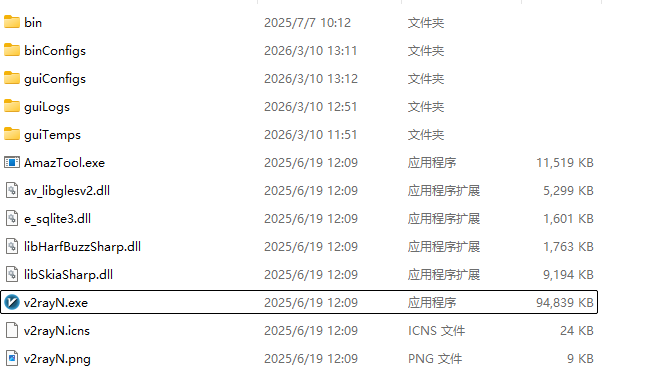
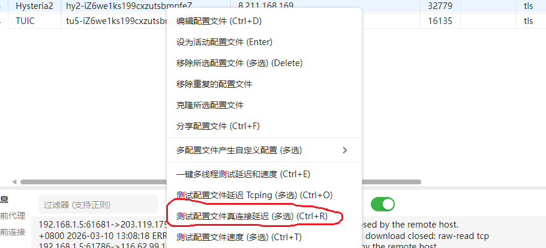

# 第一步：所需的准备
- 阿里云账户注册（如果已经拥有则可以跳过），没有注册提醒用户前往https://account.aliyun.com/register/qr_register.htm注册
- 拥有海外支付能力（大陆银行卡不可以支付）的朋友也可以选择aws lightsail，方法完全相同。
- 不建议选择其他廉价vps,实测到大陆的网络很差，没有对应的网络优化

# 第二步：在确保用户注册完毕后，
- 前往https://swasnext.console.aliyun.com/buy#/购买vps
- 实例选择通用型28元/月，系统镜像选择Debian,(2核0.5g对于个人用VPN已经足够了）
- 地域自己选择，推荐东京（几乎无限制的同时，速率也较为不错），由需要体验最新AI产品的用户，也可以选择美国地区
- 购买一个月，自主决定是否开启自动续费，阿里云5天内支持无条件退款，所以无需担心配置失败问题
- 在防火墙处打开所有端口，应用类型选择全部TCP+UDP即可


# 第三步：下载客户端
- 根据你所在的环境，在https://github.com/2dust/v2rayN/releases上下载对应的软件包，安装参考https://github.com/2dust/v2rayN/wiki/Release-files-introduction
- 对于win用户，下载v2rayN-windows-64-desktop.zip即可
- win中软件还需要解压，解压后点击v2rayN.exe 即可以正常打开
- 其他平台（包括移动）用户可以在https://github.com/2dust/v2rayN参考相关安装说明


# 第四步 ：在https://swasnext.console.aliyun.com/servers界面点击重置密码，
- 执行以下命令链接
- 在远端执行命令，脚本源码仓库https://github.com/gansxx/net_tools
```bash
bash <(wget -qO- https://raw.githubusercontent.com/gansxx/net_tools/main/sb.sh)
```
- 等待脚本执行完毕，复制最后生成的链接
- 示例：
```text
🚀【 四合一聚合订阅 】节点信息如下：
分享链接
dmxlc3M6Ly84YWYxYWE4Zi1hNjcyLTQ1YTktYjVjOC05NmMyYmQzMDA1ZmVAOC4yMTEuMTY4LjE2OToyNzU5ND9lbmNyeXB0aW9uPW5vbmUmZmxvdz14dGxzLXJwcngtdmlzaW9uJnNlY3VyaXR5PXJlYWxpdHkmc25pPXd3dy55YWhvby5jb20mZnA9Y2hyb21lJnBiaz14RXVGWWxIMEFUbVNvZENRYjFPRkRPSldmb05MU1FQWVpfZTB5dW5PWUc0JnNpZD01OGI5MTQ3OSZ0eXBlPXRjcCZoZWFkZXJUeXBlPW5vbmUjdmwtcmVhbGl0eS1pWjZ3ZTFrczE5OWN4enV0c2JtcGZlWgp2bWVzczovL2V5SmhaR1FpT2lJNExqSXhNUzR4TmpndU1UWTVJaXdpWVdsa0lqb2lNQ0lzSW1odmMzUWlPaUozZDNjdVltbHVaeTVqYjIwaUxDSnBaQ0k2SWpoaFpqRmhZVGhtTFdFMk56SXRORFZoT1MxaU5XTTRMVGsyWXpKaVpETXdNRFZtWlNJc0ltNWxkQ0k2SW5keklpd2ljR0YwYUNJNklqaGhaakZoWVRobUxXRTJOekl0TkRWaE9TMWlOV000TFRrMll6SmlaRE13TURWbVpTMTJiU0lzSW5CdmNuUWlPaUk0TURnd0lpd2ljSE1pT2lKMmJTMTNjeTFwV2paM1pURnJjekU1T1dONGVuVjBjMkp0Y0dabFdpSXNJblJzY3lJNklpSXNJblI1Y0dVaU9pSnViMjVsSWl3aWRpSTZJaklpZlFvPQpoeXN0ZXJpYTI6Ly84YWYxYWE4Zi1hNjcyLTQ1YTktYjVjOC05NmMyYmQzMDA1ZmVAOC4yMTEuMTY4LjE2OTozMjc3OT9zZWN1cml0eT10bHMmYWxwbj1oMyZpbnNlY3VyZT0xJnNuaT13d3cuYmluZy5jb20jaHkyLWlaNndlMWtzMTk5Y3h6dXRzYm1wZmVaCnR1aWM6Ly84YWYxYWE4Zi1hNjcyLTQ1YTktYjVjOC05NmMyYmQzMDA1ZmU6OGFmMWFhOGYtYTY3Mi00NWE5LWI1YzgtOTZjMmJkMzAwNWZlQDguMjExLjE2OC4xNjk6MTYxMzU/Y29uZ2VzdGlvbl9jb250cm9sPWJiciZ1ZHBfcmVsYXlfbW9kZT1uYXRpdmUmYWxwbj1oMyZzbmk9d3d3LmJpbmcuY29tJmFsbG93X2luc2VjdXJlPTEjdHU1LWlaNndlMWtzMTk5Y3h6dXRzYm1wZmVaCg==
```
# 第五步： 测试和提醒
- 首要推荐使用hysteria协议，使用体验最佳，延迟最低
## 测试
- 在将链接复制到客户端后，右键单击测试配置文件真延迟
- 测试时只要显示的延迟如图不是-1，则代表能够正常访问

## 额外提醒
- 检测时，延迟-1，无法正常连接，通常是第三步阿里云处的防火墙存在问题
- 需要让任何应用（如antigravity,cursor以及wsl中的应用）都使用VPN时，开启tun模式即可
- 遇到google网站无法打开通常是规则配置问题，可以自己重新写一份规则，把平常需要用的大陆网站走直连，其他全部打开即可
- 遇到校园网或公司内网内端口突然无法访问问题，通常是内网对端口的临时封锁导致的，而非服务器本身，解决方案有稍等一会，或者配置端口跳跃即可
- 如果还存在无法解决问题，欢迎提issue，或通过gansxxzhgo@gmail.com联系以取得帮助
